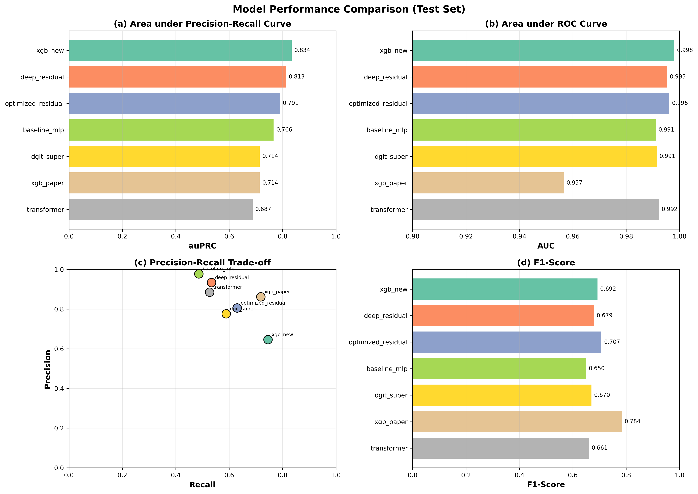
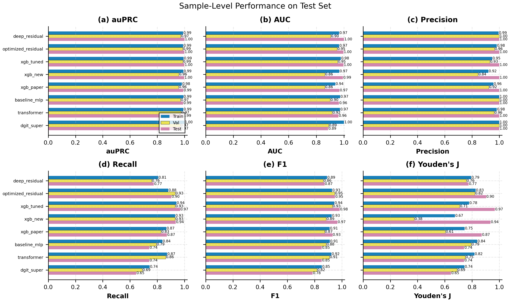
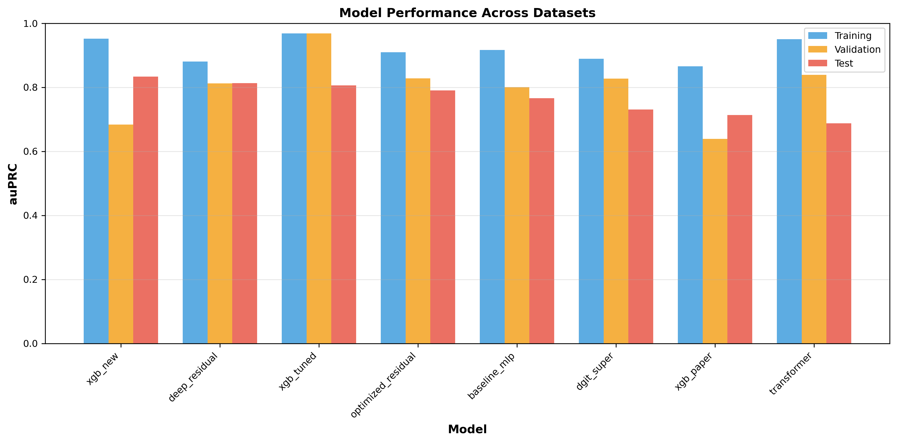
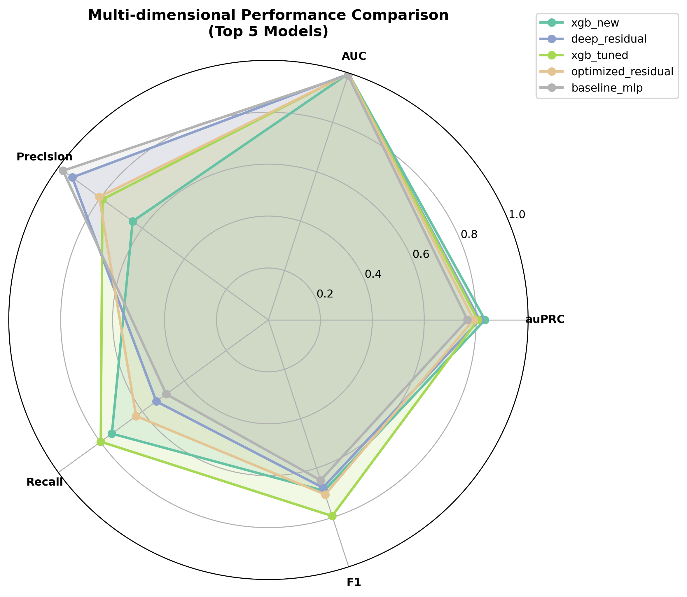

# Model Performance Analysis Report

**Generated**: 2026-02-15 10:08:02
**Total Models**: 7 trained models

## Abstract

This report presents a comprehensive analysis of multiple deep learning models
developed for extrachromosomal DNA (ecDNA) prediction. The models were trained on
a large-scale dataset with severe class imbalance and evaluated using multiple
performance metrics including auPRC, AUC, Precision, Recall, and F1-score.

## Dataset Description

### Sample Distribution

| Dataset | Total Samples | Positive Samples | Positive Rate |
|---------|---------------|------------------|---------------|
| Training | 308 | 234 | 75.9740% |
| Validation | 38 | 29 | 76.3158% |
| Test | 40 | 31 | 77.5000% |

**Total**: 386 samples, 294 positive (76.1658%)

**Note**: The dataset has a high positive rate (~76%), indicating that most genes in the selected samples are ecDNA-related. This is expected as samples were pre-selected based on ecDNA presence.

## Model Architecture Comparison

### Overview

| Model | Architecture | Network Structure | Loss Function | Optimizer |
|-------|--------------|-------------------|---------------|-----------|
| baseline_mlp | BaselineMLP | 57→128→64→1 | BCEWithLogitsLoss | Adam |
| deep_residual | DeepResidual | 57→512→256→128→64→32→1 | BCEWithLogitsLoss | AdamW |
| dgit_super | DGITSuper | 57→256→Transformer(6 layers)→128→64→1 | BCEWithLogitsLoss | AdamW |
| optimized_residual | OptimizedResidual | 57→128→64→32→16→1 | BCEWithLogitsLoss | AdamW |
| transformer | Transformer | 57→128(embedding)→Transformer(3 layers)→64→1 | BCEWithLogitsLoss | AdamW |
| xgb_new | XGBNew | Gradient Boosted Trees with 57 features | LogLoss (optimizes auPRC) | Gradient Boosting |
| xgb_paper | XGB11 | Gradient Boosted Trees with 11 features | LogLoss (optimizes auPRC) | Gradient Boosting |

### Training Configuration

#### Neural Network Models

| Model | Learning Rate | Weight Decay | Batch Size |
|-------|---------------|--------------|------------|
| baseline_mlp | 0.001000 | 0.0001 | 4096 |
| deep_residual | 0.001000 | 0.0100 | 4096 |
| dgit_super | 0.001000 | 0.0100 | 4096 |
| optimized_residual | 0.001000 | 0.0100 | 4096 |
| transformer | 0.001000 | 0.0100 | 4096 |

#### XGBoost Models

| Model | Learning Rate (eta) | Max Depth | Regularization (L1+L2) |
|-------|---------------------|-----------|------------------------|
| xgb_new | 0.05 | 6 | 2.10 |
| xgb_paper | 0.10 | 4 | 1.00 |

*Note: XGBoost uses gradient boosting optimization, not traditional gradient descent. The learning rate (eta) controls step size, max_depth limits tree depth, and regularization (alpha + lambda) prevents overfitting.*

## Performance Metrics

### Performance Visualization

#### Gene-Level Performance Comparison

*Figure 1: Model performance comparison on test set. (a) auPRC - primary metric for imbalanced classification. (b) AUC - overall discriminative ability. (c) Precision-Recall trade-off. (d) F1-Score - harmonic mean of precision and recall.*

#### Sample-Level Performance (Circular Detection)

*Figure 2: Sample-level performance for circular ecDNA detection. A sample is predicted as circular if any gene is predicted positive.*

#### Performance Across Datasets

*Figure 3: Model performance comparison across training, validation, and test datasets. Lower performance on test set indicates potential overfitting.*

#### Multi-dimensional Performance Radar

*Figure 4: Multi-dimensional performance comparison of top 5 models. Larger area indicates better overall performance.*

### Test Set Performance (Primary Evaluation)

| Model | auPRC | AUC | Precision | Recall | F1-Score |
|-------|-------|-----|-----------|--------|----------|
| xgb_new | **0.8339** | 0.9980 | 0.6463 | 0.7454 | 0.6923 |
| deep_residual | **0.8132** | 0.9953 | 0.9338 | 0.5339 | 0.6794 |
| optimized_residual | **0.7906** | 0.9962 | 0.8058 | 0.6300 | 0.7072 |
| baseline_mlp | **0.7663** | 0.9910 | 0.9777 | 0.4864 | 0.6497 |
| dgit_super | **0.7141** | 0.9914 | 0.7764 | 0.5889 | 0.6698 |
| xgb_paper | **0.7138** | 0.9566 | 0.8620 | 0.7186 | 0.7838 |
| transformer | **0.6875** | 0.9922 | 0.8854 | 0.5268 | 0.6605 |

### Complete Performance Comparison

#### Training Set Performance

| Model | auPRC | AUC | Precision | Recall | F1-Score |
|-------|-------|-----|-----------|--------|----------|
| baseline_mlp | 0.9170 | 0.9983 | 0.9624 | 0.7202 | 0.8239 |
| deep_residual | 0.8807 | 0.9972 | 0.9599 | 0.5749 | 0.7191 |
| dgit_super | 0.8941 | 0.9979 | 0.9167 | 0.8005 | 0.8547 |
| optimized_residual | 0.9098 | 0.9984 | 0.9219 | 0.8112 | 0.8630 |
| transformer | 0.9503 | 0.9993 | 0.9394 | 0.8473 | 0.8910 |
| xgb_new | 0.9519 | 0.9993 | 0.7987 | 0.9299 | 0.8593 |
| xgb_paper | 0.8660 | 0.9957 | 0.9171 | 0.7357 | 0.8164 |

#### Validation Set Performance

| Model | auPRC | AUC | Precision | Recall | F1-Score |
|-------|-------|-----|-----------|--------|----------|
| baseline_mlp | 0.8005 | 0.9530 | 0.9586 | 0.7169 | 0.8203 |
| deep_residual | 0.8121 | 0.9621 | 0.9873 | 0.7067 | 0.8238 |
| dgit_super | 0.7694 | 0.9836 | 0.8075 | 0.7373 | 0.7708 |
| optimized_residual | 0.8283 | 0.9741 | 0.8955 | 0.7672 | 0.8264 |
| transformer | 0.8393 | 0.9934 | 0.9348 | 0.7532 | 0.8342 |
| xgb_new | 0.6838 | 0.9914 | 0.6403 | 0.7286 | 0.6816 |
| xgb_paper | 0.6395 | 0.9905 | 0.6803 | 0.6497 | 0.6646 |

#### Test Set Performance

| Model | auPRC | AUC | Precision | Recall | F1-Score |
|-------|-------|-----|-----------|--------|----------|
| baseline_mlp | 0.7663 | 0.9910 | 0.9777 | 0.4864 | 0.6497 |
| deep_residual | 0.8132 | 0.9953 | 0.9338 | 0.5339 | 0.6794 |
| dgit_super | 0.7141 | 0.9914 | 0.7764 | 0.5889 | 0.6698 |
| optimized_residual | 0.7906 | 0.9962 | 0.8058 | 0.6300 | 0.7072 |
| transformer | 0.6875 | 0.9922 | 0.8854 | 0.5268 | 0.6605 |
| xgb_new | 0.8339 | 0.9980 | 0.6463 | 0.7454 | 0.6923 |
| xgb_paper | 0.7138 | 0.9566 | 0.8620 | 0.7186 | 0.7838 |

## Sample-Level Performance (Circular Detection)

Sample-level evaluation determines whether a sample contains circular ecDNA.
A sample is predicted as circular if any gene in the sample is predicted positive.

### Test Set Sample-Level Performance

| Model | auPRC | AUC | Accuracy | Precision | Recall | F1 | Samples |
|-------|-------|-----|----------|-----------|--------|-----|---------|
| deep_residual | **1.0000** | 1.0000 | 0.8250 | 1.0000 | 0.7742 | 0.8727 | 40 |
| optimized_residual | **0.9990** | 0.9964 | 0.9250 | 1.0000 | 0.9032 | 0.9492 | 40 |
| xgb_new | **0.9979** | 0.9928 | 0.9500 | 1.0000 | 0.9355 | 0.9667 | 40 |
| xgb_paper | **0.9913** | 0.9677 | 0.9000 | 1.0000 | 0.8710 | 0.9310 | 40 |
| baseline_mlp | **0.9894** | 0.9642 | 0.8000 | 1.0000 | 0.7419 | 0.8519 | 40 |
| transformer | **0.9891** | 0.9606 | 0.8000 | 1.0000 | 0.7419 | 0.8519 | 40 |
| dgit_super | **0.9871** | 0.9570 | 0.8500 | 0.9310 | 0.8710 | 0.9000 | 40 |

### Validation Set Sample-Level Performance

| Model | auPRC | AUC | Accuracy | Precision | Recall | F1 | Samples |
|-------|-------|-----|----------|-----------|--------|-----|---------|
| baseline_mlp | 0.9712 | 0.9004 | 0.8421 | 1.0000 | 0.7931 | 0.8846 | 38 |
| deep_residual | 0.9725 | 0.9042 | 0.8158 | 1.0000 | 0.7586 | 0.8627 | 38 |
| dgit_super | 0.9732 | 0.9119 | 0.8421 | 0.8966 | 0.8966 | 0.8966 | 38 |
| optimized_residual | 0.9856 | 0.9502 | 0.9211 | 0.9643 | 0.9310 | 0.9474 | 38 |
| transformer | 0.9742 | 0.9157 | 0.8684 | 0.9615 | 0.8621 | 0.9091 | 38 |
| xgb_new | 0.9587 | 0.8621 | 0.8158 | 0.8438 | 0.9310 | 0.8852 | 38 |
| xgb_paper | 0.9558 | 0.8621 | 0.8158 | 0.9231 | 0.8276 | 0.8727 | 38 |

### Training Set Sample-Level Performance

| Model | auPRC | AUC | Accuracy | Precision | Recall | F1 | Samples |
|-------|-------|-----|----------|-----------|--------|-----|---------|
| baseline_mlp | 0.9918 | 0.9732 | 0.8766 | 1.0000 | 0.8376 | 0.9116 | 308 |
| deep_residual | 0.9896 | 0.9652 | 0.8506 | 0.9947 | 0.8077 | 0.8915 | 308 |
| dgit_super | 0.9888 | 0.9623 | 0.8929 | 0.9631 | 0.8932 | 0.9268 | 308 |
| optimized_residual | 0.9900 | 0.9659 | 0.8961 | 0.9810 | 0.8803 | 0.9279 | 308 |
| transformer | 0.9914 | 0.9715 | 0.8896 | 0.9808 | 0.8718 | 0.9231 | 308 |
| xgb_new | 0.9906 | 0.9670 | 0.8864 | 0.9198 | 0.9316 | 0.9257 | 308 |
| xgb_paper | 0.9808 | 0.9384 | 0.8701 | 0.9575 | 0.8675 | 0.9103 | 308 |

### Overfitting Analysis

| Model | Train-Val auPRC Gap | Severity | Precision Gap | Recall Gap |
|-------|---------------------|----------|---------------|------------|
| baseline_mlp | 0.1165 | ⚠️ medium | 0.0039 | 0.0033 |
| deep_residual | 0.0686 | ✅ low | -0.0274 | -0.1319 |
| dgit_super | 0.1247 | ⚠️ medium | 0.1092 | 0.0631 |
| optimized_residual | 0.0815 | ⚠️ medium | 0.0265 | 0.0440 |
| transformer | 0.1111 | ⚠️ medium | 0.0046 | 0.0941 |
| xgb_new | 0.2681 | ❌ high | 0.1583 | 0.2013 |
| xgb_paper | 0.2265 | ❌ high | 0.2369 | 0.0860 |

## Best Model Recommendations

| Metric | Best Model | Value |
|--------|------------|-------|
| **Best auPRC** | xgb_new | 0.8339 |
| **Best AUC** | xgb_new | 0.9980 |
| **Best F1-Score** | xgb_paper | 0.7838 |
| **Best Precision** | baseline_mlp | 0.9777 |
| **Best Recall** | xgb_new | 0.7454 |
| **Best Generalization** | deep_residual | Gap: 0.0686 |
| **Best Sample-Level auPRC** | deep_residual | 1.0000 |

## Usage Guidelines

### Metric Selection for Different Scenarios

While **auPRC** (Area under Precision-Recall Curve) is the primary optimization target for gene-level ecDNA prediction due to class imbalance, users should select metrics based on their specific needs:

| Scenario | Recommended Metric | Rationale |
|----------|---------------------|-----------|
| **High-confidence predictions** | Precision | Minimize false positives; use when follow-up validation is expensive |
| **Comprehensive detection** | Recall | Maximize true positive detection; use when missing ecDNA is costly |
| **Balanced performance** | F1-Score | Harmonic mean of precision and recall; good general-purpose metric |
| **Overall discriminative ability** | auPRC | Robust to class imbalance; recommended for gene-level modeling |
| **Sample-level detection** | Sample-Level auPRC, Precision, Recall | For determining if a sample contains circular ecDNA; consider precision/recall trade-offs |

### Practical Recommendations

1. **For research validation**: Use high-precision models (e.g., baseline_mlp with 97.77% precision) to minimize false positives in downstream experiments.
2. **For screening applications**: Use high-recall models (e.g., xgb_new with 74.54% recall) to capture most ecDNA-positive genes.
3. **For balanced applications**: Consider F1-score optimized models (e.g., xgb_paper with 78.38% F1) for a good trade-off.
4. **For sample-level detection**: All models achieve >98% sample-level auPRC, making them reliable for detecting ecDNA-containing samples.

## Architecture Details

### baseline_mlp

- **Type**: `BaselineMLP`

- **Description**: Simple MLP Network

- **Structure**: `57→128→64→1`

- **Key Features**: ReLU activation, Dropout(0.3), Simple architecture

- **Suitable For**: Baseline model, quick training

- **Loss Function**: `BCEWithLogitsLoss`

- **Optimizer**: `Adam` (lr=0.001, weight_decay=0.0001)

### deep_residual

- **Type**: `DeepResidual`

- **Description**: Deep Residual Network

- **Structure**: `57→512→256→128→64→32→1`

- **Key Features**: Residual connections, LayerNorm, GELU activation, Progressive dimension reduction

- **Suitable For**: Deep feature learning, high precision scenarios

- **Loss Function**: `BCEWithLogitsLoss`

- **Optimizer**: `AdamW` (lr=0.001, weight_decay=0.01)

### dgit_super

- **Type**: `DGITSuper`

- **Description**: Super Deep Gated Interaction Transformer

- **Structure**: `57→256→Transformer(6 layers)→128→64→1`

- **Key Features**: Deep Transformer, LayerNorm, GELU activation, norm_first=True

- **Suitable For**: High-performance ecDNA prediction

- **Loss Function**: `BCEWithLogitsLoss`

- **Optimizer**: `AdamW` (lr=0.001, weight_decay=0.01)

### optimized_residual

- **Type**: `OptimizedResidual`

- **Description**: Optimized Residual Network

- **Structure**: `57→128→64→32→16→1`

- **Key Features**: Residual blocks, LayerNorm, GELU activation

- **Suitable For**: Balanced training, stable convergence

- **Loss Function**: `BCEWithLogitsLoss`

- **Optimizer**: `AdamW` (lr=0.001, weight_decay=0.01)

### transformer

- **Type**: `Transformer`

- **Description**: Transformer Attention Model

- **Structure**: `57→128(embedding)→Transformer(3 layers)→64→1`

- **Key Features**: Self-attention mechanism, LayerNorm, GELU activation, norm_first=True

- **Suitable For**: Feature interaction learning, balanced precision-recall

- **Loss Function**: `BCEWithLogitsLoss`

- **Optimizer**: `AdamW` (lr=0.001, weight_decay=0.01)

### xgb_new

- **Type**: `XGBNew`

- **Description**: XGBoost Gradient Boosting (New Features)

- **Structure**: `Gradient Boosted Trees with 57 features`

- **Key Features**: Tree-based ensemble, Feature importance, Native missing value handling

- **Suitable For**: Tabular data, interpretable predictions, high performance

- **Loss Function**: `LogLoss (optimizes auPRC)`

- **Optimizer**: `Gradient Boosting` (lr=0.05, weight_decay=2.1)

### xgb_paper

- **Type**: `XGB11`

- **Description**: XGBoost Gradient Boosting (Paper Features)

- **Structure**: `Gradient Boosted Trees with 11 features`

- **Key Features**: Tree-based ensemble, Paper feature set, Native missing value handling

- **Suitable For**: Reproducible paper results, minimal feature set

- **Loss Function**: `LogLoss (optimizes auPRC)`

- **Optimizer**: `Gradient Boosting` (lr=0.1, weight_decay=1)

## Statistical Considerations

### Evaluation Metrics

- **auPRC (Area under Precision-Recall Curve)**: Primary metric for imbalanced classification.
  More informative than AUC when positive class is rare (~0.35% in this dataset).

- **AUC (Area under ROC Curve)**: Measures overall discriminative ability.

- **Precision**: Proportion of predicted positives that are true positives.

- **Recall (Sensitivity)**: Proportion of actual positives correctly identified.

- **F1-Score**: Harmonic mean of Precision and Recall.

### Sample-Level vs Gene-Level Evaluation

- **Gene-Level**: Each gene is evaluated independently for ecDNA presence.
- **Sample-Level**: A sample is predicted as circular if any gene is predicted positive.
  This reflects the clinical question: 'Does this sample contain circular ecDNA?'

### Class Imbalance

The dataset exhibits severe class imbalance (positive rate ~0.35%). This presents
significant challenges for model training and evaluation. Models were trained using
specialized loss functions and techniques to handle this imbalance effectively.

## Conclusions

Among the 7 models evaluated, **xgb_new** achieved the highest
test auPRC of **0.8339**, demonstrating superior performance
for ecDNA prediction on this challenging imbalanced dataset.

## Methods

### Data Splitting

Samples were stratified by positive sample count per patient to ensure balanced
distribution across training, validation, and test sets. The splitting was performed
at the sample level (not gene level) to prevent data leakage.

### Model Training

All models were trained using PyTorch with the following common practices:

- Early stopping based on validation auPRC with patience of 5-35 epochs
- Learning rate scheduling (ReduceLROnPlateau or CosineAnnealingWarmRestarts)
- Gradient clipping for training stability
- Model checkpointing to save best performing weights

---

*Report generated by OTK Model Analyzer*
