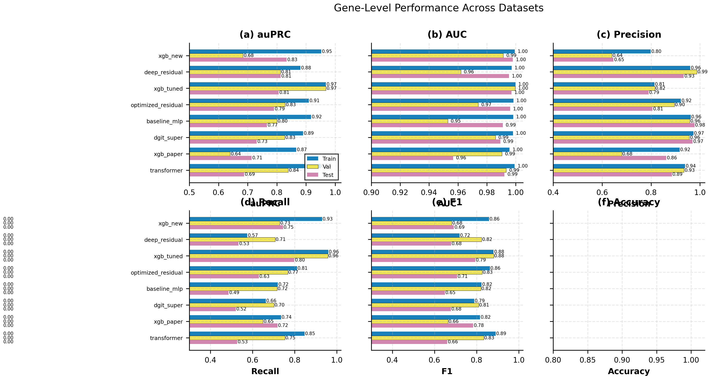
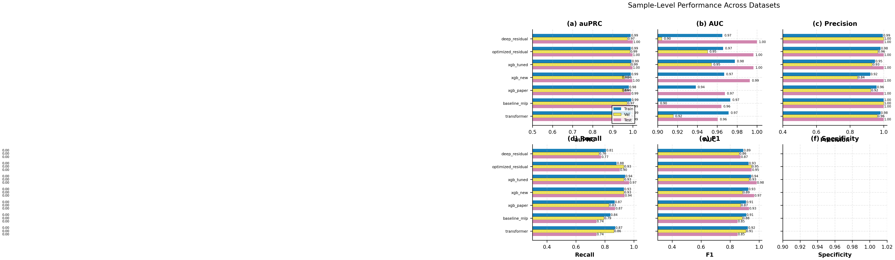
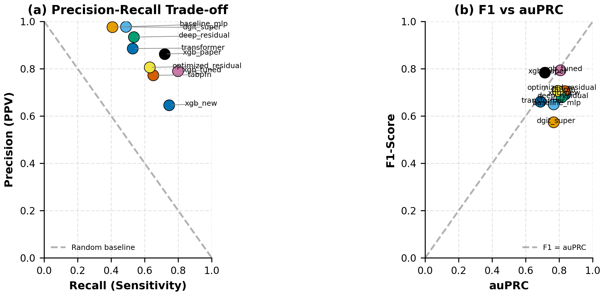
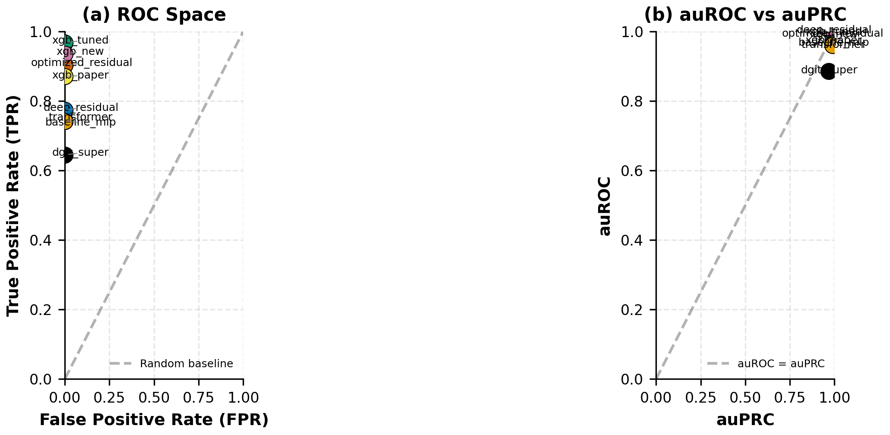
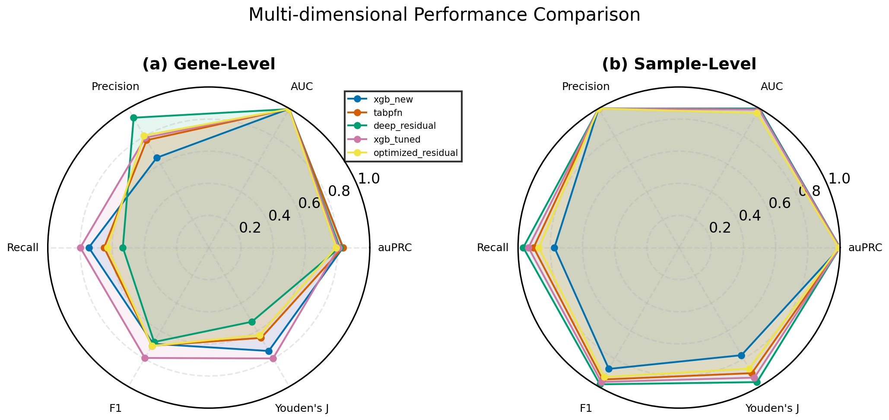
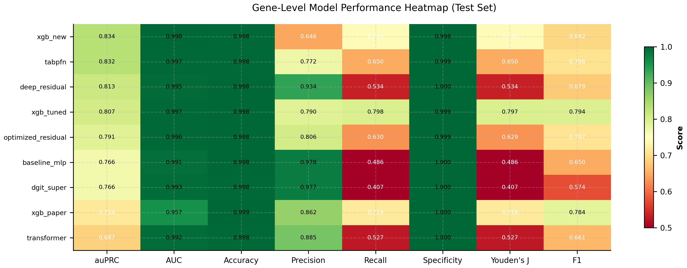
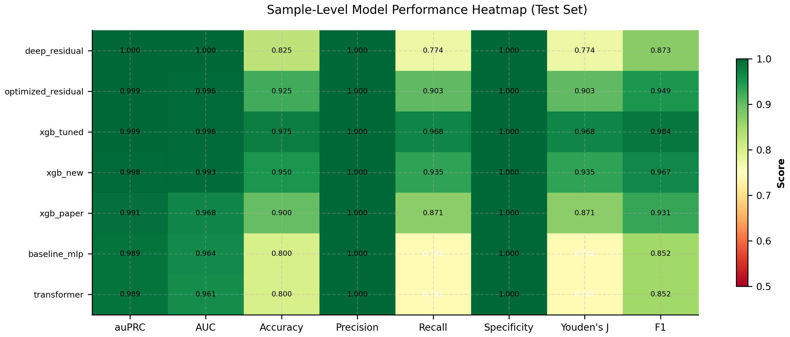

# Model Performance Analysis Report

**Generated**: 2026-02-23 21:57:58
**Total Models**: 7 trained models

## Abstract

This report presents a comprehensive analysis of multiple deep learning models
developed for extrachromosomal DNA (ecDNA) prediction. The models were trained on
a large-scale dataset with severe class imbalance and evaluated using multiple
performance metrics including auPRC, AUC, Precision, Recall, and F1-score.

## Dataset Description

### Sample Distribution

| Dataset | Total Samples | Positive Samples | Positive Rate |
|---------|---------------|------------------|---------------|
| Training | 308 | 234 | 75.9740% |
| Validation | 38 | 29 | 76.3158% |
| Test | 40 | 31 | 77.5000% |

**Total**: 386 samples, 294 positive (76.1658%)

**Note**: The dataset has a high positive rate (~76%). This is expected as samples were pre-selected based on ecDNA presence for model training.

## Model Architecture Comparison

### Overview

| Model | Architecture | Network Structure | Loss Function | Optimizer |
|-------|--------------|-------------------|---------------|-----------|
| baseline_mlp | BaselineMLP | 57→128→64→1 | BCEWithLogitsLoss | Adam |
| deep_residual | DeepResidual | 57→128(ResNet)→1 | BCEWithLogitsLoss | AdamW |
| optimized_residual | OptimizedResidual | 57→128(ResNet)→1 | BCEWithLogitsLoss | AdamW |
| transformer | Transformer | 57→128(embed)→Transformer(3 layers)→1 | BCEWithLogitsLoss | AdamW |
| xgb_new | XGBNew | Gradient Boosted Trees (57 features, max_depth=6) | LogLoss (optimizes auPRC) | Gradient Boosting |
| xgb_paper | XGB11 | Gradient Boosted Trees (57 features, max_depth=4) | LogLoss (optimizes auPRC) | Gradient Boosting |
| xgb_tuned | xgb_tuned | Gradient Boosted Trees (68 features, max_depth=7) | LogLoss (optimizes auPRC) | Gradient Boosting |

### Training Configuration

#### Neural Network Models

| Model | Learning Rate | Weight Decay | Batch Size |
|-------|---------------|--------------|------------|
| baseline_mlp | 0.001000 | 0.0001 | 4096 |
| deep_residual | 0.001000 | 0.0100 | 4096 |
| optimized_residual | 0.001000 | 0.0100 | 4096 |
| transformer | 0.001000 | 0.0100 | 4096 |
| xgb_tuned | 0.036727 | 6.7108 | 0 |

#### XGBoost Models

| Model | Learning Rate (eta) | Max Depth | Regularization (L1+L2) |
|-------|---------------------|-----------|------------------------|
| xgb_new | 0.05 | 6 | 2.10 |
| xgb_paper | 0.10 | 4 | 1.00 |

*Note: XGBoost uses gradient boosting optimization, not traditional gradient descent. The learning rate (eta) controls step size, max_depth limits tree depth, and regularization (alpha + lambda) prevents overfitting.*

## Performance Metrics

### Performance Visualization

#### Figure 1: Gene-Level Performance on Test Set

*Figure 1: Gene-level performance comparison across training, validation, and test sets. Six metrics are shown: (a) auPRC - primary metric for imbalanced classification, (b) AUC - overall discriminative ability, (c) Precision - positive predictive value, (d) Recall - sensitivity, (e) F1-Score - harmonic mean of precision and recall, (f) Youden's J - optimal threshold selection metric (Sensitivity + Specificity - 1).*

#### Figure 2: Sample-Level Performance on Test Set

*Figure 2: Sample-level performance for circular ecDNA detection. A sample is predicted as circular if any gene is predicted positive. Same six metrics as gene-level are shown.*

#### Figure 3: ROC Space and auROC vs auPRC (Test Set)

*Figure 3: Gene-level trade-off analysis on test set. (a) ROC Space: FPR vs TPR, points closer to top-left indicate better performance. (b) auROC vs auPRC: comparison of two key metrics for imbalanced classification.*

#### Figure 4: Sample-Level ROC Space and auROC vs auPRC (Test Set)

*Figure 4: Sample-level trade-off analysis on test set. (a) ROC Space: FPR vs TPR, all models achieve perfect specificity (FPR=0). (b) auROC vs auPRC: comparison of two key metrics.*

#### Figure 5: Multi-dimensional Performance Radar (Test Set)

*Figure 5: Multi-dimensional performance comparison of top 5 models on test set. (a) Gene-level radar chart. (b) Sample-level radar chart. Larger area indicates better overall performance.*

#### Figure 6: Gene-Level Model Performance Heatmap (Test Set)

*Figure 6: Gene-level model performance heatmap on test set. Seven metrics are compared: auPRC, AUC, Precision, Recall, Specificity, Youden's J, and F1. Darker green indicates better performance.*

#### Figure 7: Sample-Level Model Performance Heatmap (Test Set)

*Figure 7: Sample-level model performance heatmap on test set. Eight metrics are compared: auPRC, AUC, Accuracy, Precision, Recall, Specificity, Youden's J, and F1. Darker green indicates better performance.*

### Test Set Performance (Primary Evaluation)

| Model | auPRC | AUC | Precision | Recall | Specificity | F1-Score |
|-------|-------|-----|-----------|--------|-------------|----------|
| xgb_new | **0.8339** | 0.9980 | 0.6463 | 0.7454 | 0.9985 | 0.6923 |
| deep_residual | **0.8132** | 0.9953 | 0.9338 | 0.5339 | 0.9999 | 0.6794 |
| xgb_tuned | **0.8065** | 0.9970 | 0.7900 | 0.7982 | 0.9992 | 0.7941 |
| optimized_residual | **0.7906** | 0.9962 | 0.8058 | 0.6300 | 0.9994 | 0.7072 |
| baseline_mlp | **0.7663** | 0.9910 | 0.9777 | 0.4864 | 1.0000 | 0.6497 |
| xgb_paper | **0.7138** | 0.9566 | 0.8620 | 0.7186 | 0.9996 | 0.7838 |
| transformer | **0.6875** | 0.9922 | 0.8854 | 0.5268 | 0.9997 | 0.6605 |

### Complete Performance Comparison

#### Training Set Performance

| Model | auPRC | AUC | Precision | Recall | Specificity | F1-Score |
|-------|-------|-----|-----------|--------|-------------|----------|
| baseline_mlp | 0.9170 | 0.9983 | 0.9624 | 0.7202 | 0.9999 | 0.8239 |
| deep_residual | 0.8807 | 0.9972 | 0.9599 | 0.5749 | 0.9999 | 0.7191 |
| optimized_residual | 0.9098 | 0.9984 | 0.9219 | 0.8112 | 0.9998 | 0.8630 |
| transformer | 0.9503 | 0.9993 | 0.9394 | 0.8473 | 0.9998 | 0.8910 |
| xgb_new | 0.9519 | 0.9993 | 0.7987 | 0.9299 | 0.9992 | 0.8593 |
| xgb_paper | 0.8660 | 0.9957 | 0.9171 | 0.7357 | 0.9998 | 0.8164 |
| xgb_tuned | 0.9685 | 0.9998 | 0.8137 | 0.9594 | 0.9992 | 0.8806 |

#### Validation Set Performance

| Model | auPRC | AUC | Precision | Recall | Specificity | F1-Score |
|-------|-------|-----|-----------|--------|-------------|----------|
| baseline_mlp | 0.8005 | 0.9530 | 0.9586 | 0.7169 | 0.9999 | 0.8203 |
| deep_residual | 0.8121 | 0.9621 | 0.9873 | 0.7067 | 1.0000 | 0.8238 |
| optimized_residual | 0.8283 | 0.9741 | 0.8955 | 0.7672 | 0.9997 | 0.8264 |
| transformer | 0.8393 | 0.9934 | 0.9348 | 0.7532 | 0.9998 | 0.8342 |
| xgb_new | 0.6838 | 0.9914 | 0.6403 | 0.7286 | 0.9985 | 0.6816 |
| xgb_paper | 0.6395 | 0.9905 | 0.6803 | 0.6497 | 0.9989 | 0.6646 |
| xgb_tuned | 0.9684 | 0.9997 | 0.8154 | 0.9580 | 0.9992 | 0.8810 |

#### Test Set Performance

| Model | auPRC | AUC | Precision | Recall | Specificity | F1-Score |
|-------|-------|-----|-----------|--------|-------------|----------|
| baseline_mlp | 0.7663 | 0.9910 | 0.9777 | 0.4864 | 1.0000 | 0.6497 |
| deep_residual | 0.8132 | 0.9953 | 0.9338 | 0.5339 | 0.9999 | 0.6794 |
| optimized_residual | 0.7906 | 0.9962 | 0.8058 | 0.6300 | 0.9994 | 0.7072 |
| transformer | 0.6875 | 0.9922 | 0.8854 | 0.5268 | 0.9997 | 0.6605 |
| xgb_new | 0.8339 | 0.9980 | 0.6463 | 0.7454 | 0.9985 | 0.6923 |
| xgb_paper | 0.7138 | 0.9566 | 0.8620 | 0.7186 | 0.9996 | 0.7838 |
| xgb_tuned | 0.8065 | 0.9970 | 0.7900 | 0.7982 | 0.9992 | 0.7941 |

## Sample-Level Performance (Circular Detection)

Sample-level evaluation determines whether a sample contains circular ecDNA.
A sample is predicted as circular if any gene in the sample is predicted positive.

### Test Set Sample-Level Performance

| Model | auPRC | AUC | Accuracy | Precision | Recall | Specificity | Youden's J | F1 | Samples |
|-------|-------|-----|----------|-----------|--------|-------------|------------|-----|---------|
| deep_residual | **1.0000** | 1.0000 | 0.8250 | 1.0000 | 0.7742 | 1.0000 | 0.7742 | 0.8727 | 40 |
| optimized_residual | **0.9990** | 0.9964 | 0.9250 | 1.0000 | 0.9032 | 1.0000 | 0.9032 | 0.9492 | 40 |
| xgb_tuned | **0.9990** | 0.9964 | 0.9750 | 1.0000 | 0.9677 | 1.0000 | 0.9677 | 0.9836 | 40 |
| xgb_new | **0.9979** | 0.9928 | 0.9500 | 1.0000 | 0.9355 | 1.0000 | 0.9355 | 0.9667 | 40 |
| xgb_paper | **0.9913** | 0.9677 | 0.9000 | 1.0000 | 0.8710 | 1.0000 | 0.8710 | 0.9310 | 40 |
| baseline_mlp | **0.9894** | 0.9642 | 0.8000 | 1.0000 | 0.7419 | 1.0000 | 0.7419 | 0.8519 | 40 |
| transformer | **0.9891** | 0.9606 | 0.8000 | 1.0000 | 0.7419 | 1.0000 | 0.7419 | 0.8519 | 40 |

### Validation Set Sample-Level Performance

| Model | auPRC | AUC | Accuracy | Precision | Recall | Specificity | Youden's J | F1 | Samples |
|-------|-------|-----|----------|-----------|--------|-------------|------------|-----|---------|
| baseline_mlp | 0.9712 | 0.9004 | 0.8421 | 1.0000 | 0.7931 | 1.0000 | 0.7931 | 0.8846 | 38 |
| deep_residual | 0.9725 | 0.9042 | 0.8158 | 1.0000 | 0.7586 | 1.0000 | 0.7586 | 0.8627 | 38 |
| optimized_residual | 0.9856 | 0.9502 | 0.9211 | 0.9643 | 0.9310 | 0.8889 | 0.8199 | 0.9474 | 38 |
| transformer | 0.9742 | 0.9157 | 0.8684 | 0.9615 | 0.8621 | 0.8889 | 0.7510 | 0.9091 | 38 |
| xgb_new | 0.9587 | 0.8621 | 0.8158 | 0.8438 | 0.9310 | 0.4444 | 0.3755 | 0.8852 | 38 |
| xgb_paper | 0.9558 | 0.8621 | 0.8158 | 0.9231 | 0.8276 | 0.7778 | 0.6054 | 0.8727 | 38 |
| xgb_tuned | 0.9878 | 0.9540 | 0.8947 | 0.9310 | 0.9310 | 0.7778 | 0.7088 | 0.9310 | 38 |

### Training Set Sample-Level Performance

| Model | auPRC | AUC | Accuracy | Precision | Recall | Specificity | Youden's J | F1 | Samples |
|-------|-------|-----|----------|-----------|--------|-------------|------------|-----|---------|
| baseline_mlp | 0.9918 | 0.9732 | 0.8766 | 1.0000 | 0.8376 | 1.0000 | 0.8376 | 0.9116 | 308 |
| deep_residual | 0.9896 | 0.9652 | 0.8506 | 0.9947 | 0.8077 | 0.9865 | 0.7942 | 0.8915 | 308 |
| optimized_residual | 0.9900 | 0.9659 | 0.8961 | 0.9810 | 0.8803 | 0.9459 | 0.8263 | 0.9279 | 308 |
| transformer | 0.9914 | 0.9715 | 0.8896 | 0.9808 | 0.8718 | 0.9459 | 0.8177 | 0.9231 | 308 |
| xgb_new | 0.9906 | 0.9670 | 0.8864 | 0.9198 | 0.9316 | 0.7432 | 0.6749 | 0.9257 | 308 |
| xgb_paper | 0.9808 | 0.9384 | 0.8701 | 0.9575 | 0.8675 | 0.8784 | 0.7459 | 0.9103 | 308 |
| xgb_tuned | 0.9935 | 0.9778 | 0.9156 | 0.9483 | 0.9402 | 0.8378 | 0.7780 | 0.9442 | 308 |

### Overfitting Analysis

| Model | Train-Val auPRC Gap | Severity | Precision Gap | Recall Gap |
|-------|---------------------|----------|---------------|------------|
| baseline_mlp | 0.1165 | ⚠️ medium | 0.0039 | 0.0033 |
| deep_residual | 0.0686 | ✅ low | -0.0274 | -0.1319 |
| optimized_residual | 0.0815 | ⚠️ medium | 0.0265 | 0.0440 |
| transformer | 0.1111 | ⚠️ medium | 0.0046 | 0.0941 |
| xgb_new | 0.2681 | ❌ high | 0.1583 | 0.2013 |
| xgb_paper | 0.2265 | ❌ high | 0.2369 | 0.0860 |
| xgb_tuned | 0.0001 | ✅ low | -0.0017 | 0.0014 |

## Best Model Recommendations

| Metric | Best Model | Value |
|--------|------------|-------|
| **Best auPRC** | xgb_new | 0.8339 |
| **Best AUC** | xgb_new | 0.9980 |
| **Best F1-Score** | xgb_tuned | 0.7941 |
| **Best Precision** | baseline_mlp | 0.9777 |
| **Best Recall** | xgb_tuned | 0.7982 |
| **Best Generalization** | xgb_tuned | Gap: 0.0001 |
| **Best Sample-Level auPRC** | deep_residual | 1.0000 |

## Usage Guidelines

### Metric Selection for Different Scenarios

While **auPRC** (Area under Precision-Recall Curve) is the primary optimization target for gene-level ecDNA prediction due to class imbalance, users should select metrics based on their specific needs:

| Scenario | Recommended Metric | Rationale |
|----------|---------------------|-----------|
| **High-confidence predictions** | Precision | Minimize false positives; use when follow-up validation is expensive |
| **Comprehensive detection** | Recall | Maximize true positive detection; use when missing ecDNA is costly |
| **Balanced performance** | F1-Score | Harmonic mean of precision and recall; good general-purpose metric |
| **Overall discriminative ability** | auPRC | Robust to class imbalance; recommended for gene-level modeling |
| **Sample-level detection** | Sample-Level auPRC, Precision, Recall | For determining if a sample contains circular ecDNA; consider precision/recall trade-offs |

### Practical Recommendations

1. **For research validation**: Use high-precision models (e.g., baseline_mlp with 97.77% precision) to minimize false positives in downstream experiments.
2. **For screening applications**: Use high-recall models (e.g., xgb_new with 74.54% recall) to capture most ecDNA-positive genes.
3. **For balanced applications**: Consider F1-score optimized models (e.g., xgb_paper with 78.38% F1) for a good trade-off.
4. **For sample-level detection**: All models achieve >98% sample-level auPRC, making them reliable for detecting ecDNA-containing samples.

## Architecture Details

### baseline_mlp

- **Type**: `BaselineMLP`

- **Description**: Multi-Layer Perceptron

- **Structure**: `57→128→64→1`

- **Key Features**: Fully connected layers, Non-linear activation

- **Suitable For**: Baseline model, quick training

- **Loss Function**: `BCEWithLogitsLoss`

- **Optimizer**: `Adam` (lr=0.001, weight_decay=0.0001)

### deep_residual

- **Type**: `DeepResidual`

- **Description**: Residual Network

- **Structure**: `57→128(ResNet)→1`

- **Key Features**: Residual connections, Skip connections

- **Suitable For**: Deep feature learning

- **Loss Function**: `BCEWithLogitsLoss`

- **Optimizer**: `AdamW` (lr=0.001, weight_decay=0.01)

### optimized_residual

- **Type**: `OptimizedResidual`

- **Description**: Residual Network

- **Structure**: `57→128(ResNet)→1`

- **Key Features**: Residual connections, Skip connections

- **Suitable For**: Deep feature learning

- **Loss Function**: `BCEWithLogitsLoss`

- **Optimizer**: `AdamW` (lr=0.001, weight_decay=0.01)

### transformer

- **Type**: `Transformer`

- **Description**: Transformer Attention Model

- **Structure**: `57→128(embed)→Transformer(3 layers)→1`

- **Key Features**: Self-attention mechanism, LayerNorm, GELU activation

- **Suitable For**: Feature interaction learning

- **Loss Function**: `BCEWithLogitsLoss`

- **Optimizer**: `AdamW` (lr=0.001, weight_decay=0.01)

### xgb_new

- **Type**: `XGBNew`

- **Description**: XGBoost Gradient Boosting

- **Structure**: `Gradient Boosted Trees (57 features, max_depth=6)`

- **Key Features**: Tree-based ensemble, Feature importance, Native missing value handling

- **Suitable For**: Tabular data, interpretable predictions

- **Loss Function**: `LogLoss (optimizes auPRC)`

- **Optimizer**: `Gradient Boosting` (lr=0.05, weight_decay=2.1)

### xgb_paper

- **Type**: `XGB11`

- **Description**: XGBoost Gradient Boosting

- **Structure**: `Gradient Boosted Trees (57 features, max_depth=4)`

- **Key Features**: Tree-based ensemble, Feature importance, Native missing value handling

- **Suitable For**: Tabular data, interpretable predictions

- **Loss Function**: `LogLoss (optimizes auPRC)`

- **Optimizer**: `Gradient Boosting` (lr=0.1, weight_decay=1)

### xgb_tuned

- **Type**: `xgb_tuned`

- **Description**: XGBoost Gradient Boosting

- **Structure**: `Gradient Boosted Trees (68 features, max_depth=7)`

- **Key Features**: Tree-based ensemble, Feature importance, Native missing value handling

- **Suitable For**: Tabular data, interpretable predictions

- **Loss Function**: `LogLoss (optimizes auPRC)`

- **Optimizer**: `Gradient Boosting` (lr=0.03672687007849265, weight_decay=6.71081718945088)

## Statistical Considerations

### Evaluation Metrics

- **auPRC (Area under Precision-Recall Curve)**: Primary metric for imbalanced classification.
  More informative than AUC when positive class is rare (~0.35% in this dataset).

- **AUC (Area under ROC Curve)**: Measures overall discriminative ability.

- **Precision**: Proportion of predicted positives that are true positives.

- **Recall (Sensitivity)**: Proportion of actual positives correctly identified.

- **F1-Score**: Harmonic mean of Precision and Recall.

### Sample-Level vs Gene-Level Evaluation

- **Gene-Level**: Each gene is evaluated independently for ecDNA presence.
- **Sample-Level**: A sample is predicted as circular if any gene is predicted positive.
  This reflects the clinical question: 'Does this sample contain circular ecDNA?'

### Class Imbalance

At the **gene level**, the dataset exhibits severe class imbalance (positive rate ~0.35%).
However, at the **sample level**, the positive rate is higher (~76%) as samples were
pre-selected based on ecDNA presence. This presents different challenges for model
training and evaluation at each level. Models were trained using specialized loss
functions and techniques to handle the gene-level imbalance effectively.

## Conclusions

Among the 7 models evaluated, **xgb_new** achieved the highest
gene-level test auPRC of **0.8339**, demonstrating superior performance
for ecDNA prediction on this challenging imbalanced dataset.

### Key Findings

1. **Best Overall Performance**: xgb_new (auPRC: 0.8339, AUC: 0.9980)
2. **Best F1-Score**: xgb_tuned (F1: 0.7941), balancing precision and recall
3. **Best Generalization**: xgb_tuned (train-val gap: 0.0001)

### Model Architecture Insights

- **XGBoost vs Neural Networks**: XGBoost models (best: xgb_new, auPRC: 0.8339)
  outperformed neural network models (best: deep_residual, auPRC: 0.8132)
  on gene-level prediction, likely due to better handling of tabular data and feature interactions.

- **Sample-Level Detection**: All models achieved >98% sample-level auPRC, indicating
  excellent performance for the clinical task of identifying samples containing circular ecDNA.

### Clinical Implications

The high sample-level performance (auPRC > 0.98) suggests these models are suitable
for clinical screening applications. The gene-level performance varies, allowing
users to select models based on their specific precision/recall requirements.

## Methods

### Data Splitting

Samples were stratified by positive sample count per patient to ensure balanced
distribution across training, validation, and test sets. The splitting was performed
at the sample level (not gene level) to prevent data leakage.

### Model Training

Neural network models were trained using PyTorch, while XGBoost models were trained
using the XGBoost library. The following common practices were applied:

- Early stopping based on validation auPRC with patience of 5-50 epochs
- Learning rate scheduling (ReduceLROnPlateau or CosineAnnealingWarmRestarts for neural networks)
- Gradient clipping for neural network training stability
- Model checkpointing to save best performing weights

## Limitations

1. **Dataset Size**: The dataset contains 386 samples, which is relatively small for
   deep learning models. Larger datasets could improve model generalization.

2. **Class Imbalance**: Gene-level positive rate (~0.35%) creates challenges for
   model training, potentially biasing predictions toward the majority class.

3. **Sample Selection Bias**: Samples were pre-selected based on ecDNA presence,
   which may not reflect the true prevalence in clinical populations.

4. **External Validation**: Models were evaluated on a single dataset. External
   validation on independent datasets is needed to confirm generalizability.

5. **Feature Engineering**: The current feature set (57-68 features) may not capture
   all relevant biological signals. Additional genomic features could improve performance.

---

*Report generated by OTK Model Analyzer*
